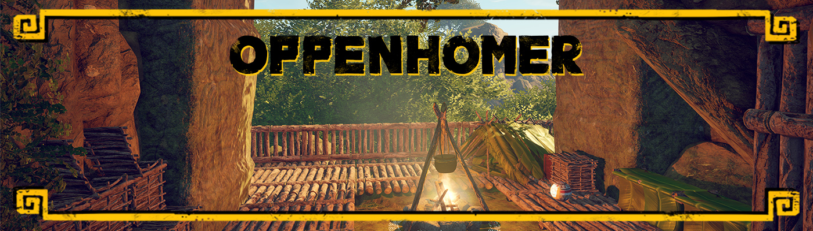
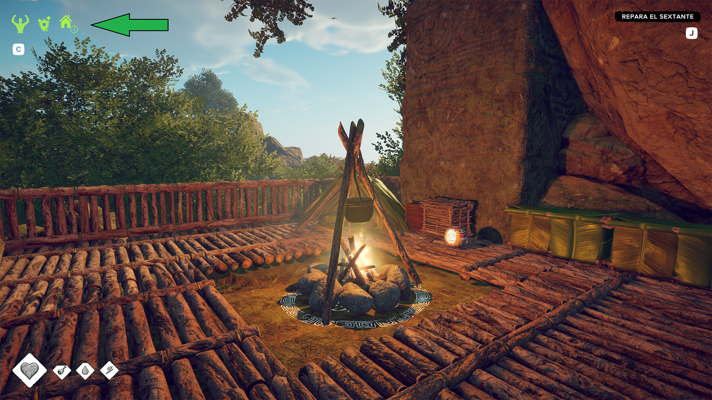
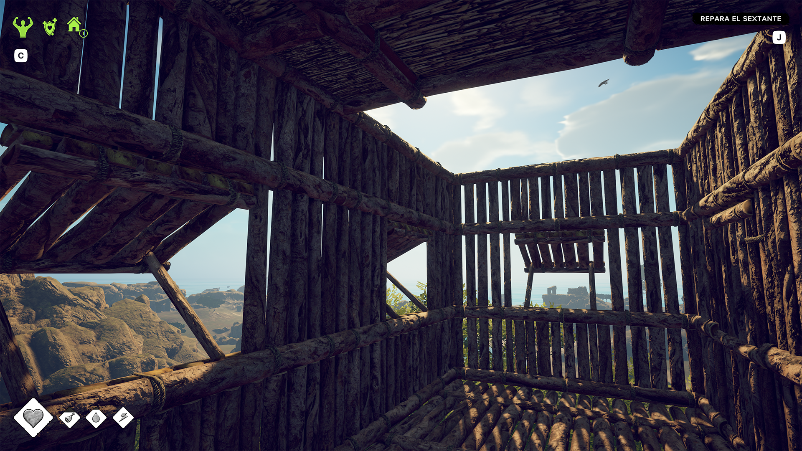

# OppenHomer 🏴‍☠️🏠

**Opening new home possibilities with natural barriers!**

A mod for **Survival: Fountain of Youth** that allows natural terrain (rocks, cliffs, caves) to complete your player-built homes. No more rejected houses when you have partial construction + natural barriers!

## ✨ Features

- 🌿 **Natural Barriers**: Rocks, cliffs, and terrain count as walls
- 🚪 **Flexible Openings**: Supports configurable openings (default 25% max)
- 🏠 **Complementary Logic**: Works seamlessly with vanilla home detection
- 🎯 **Smart Detection**: Only activates when vanilla detects partial construction
- ⚙️ **Configurable**: Adjust enclosure percentage and roof requirements
- 🔧 **Unity Native**: Robust terrain detection using official Unity components
- 📊 **No Double Counting**: Natural barriers only fill gaps vanilla doesn't cover

## 🎮 How It Works

1. **Vanilla detects** your partial construction (e.g., 46% coverage)
2. **OppenHomer searches** for natural barriers in remaining directions
3. **Combines both** to complete your home (46% + 30% = 76% ✅)
4. **Allows openings** up to your configured percentage (25% by default)
5. **Respects vanilla quality** for house level (House1 vs House2)

## 🚀 Installation

### For Players
1. Download `OppenHomer.dll` from [Releases](../../releases)
2. Place in `BepInEx/plugins/` folder
3. Launch the game and enjoy!

### Requirements
- **Survival: Fountain of Youth**
- **BepInEx** framework installed

## 🤝 Recommended Companion Mods

For the best building experience, it's **highly recommended** to use OppenHomer with one of these excellent mods:

- **[Fountain Of Youth - FOV - Tweaks](https://github.com/norgerarc/FOYTweaks)** by Norger
- **[No Build Restrictions](https://github.com/dazawmbie/NoBuildRestrictions)** by dazawmbie

These mods work perfectly together to give you ultimate building flexibility! 🛠️

## ⚙️ Configuration

Configure in `BepInEx/config/OppenHomer.cfg`:

```ini
[General]
EnableMod = true

[Detection]
MinWallEnclosurePercent = 75.0
# Minimum enclosure needed (75% = max 25% openings allowed)
# 70% = 30% openings | 80% = 20% openings | 90% = 10% openings

RequireRoof = true
# Require roof coverage for home validation

RaycastDistance = 12.0
# Detection distance in meters (8-20m recommended)

[Debug]
EnableDebugLogs = false
# Enable detailed logging (WARNING: Very verbose!)
```

## 🏗️ Perfect For

- 🏔️ **Mountain homes** with rock walls and natural doorways
- 🕳️ **Cave shelters** with natural ceilings and openings
- 🏖️ **Coastal builds** against cliffs with sea views
- 🌳 **Jungle camps** using terrain features with ventilation
- ⛰️ **Hybrid constructions** mixing built + natural with flexible openings
- 🚪 **Open-air designs** like courtyards and terraces

## 🔧 Technical Details

- **26-direction raycast** system (same as vanilla)
- **Configurable openings** - adjust from 10% to 50% open areas
- **Unity TerrainCollider** detection
- **Complementary logic** - never competes with vanilla
- **Real-time detection** - no caching, always precise
- **Physics-based** - ignores decorative objects

## 📸 Screenshots

### One side open house with natural barriers


### House detected!


### Partial open roof small house


## 🤝 Contributing

**I'm not a programmer** - this is my first mod ever, created with tremendous effort for personal use, but above all as a **tribute to all those amazing modders** who have given us so much work and dedication without asking for anything in return.
**I owe you all a fine mug of grog... when I figure out how to get one without dissolving the mug! Arrr!** 🍺

Feedback, suggestions, and contributions are welcome:
- 🐛 **Report bugs** in Issues
- 💡 **Suggest features** in Discussions
- 🔧 **Submit PRs** for improvements

## 🙏 Credits

- **Game**: Survival: Fountain of Youth by Ocelot Society
- **Framework**: BepInEx team
- **Harmony**: Patching library
- **Author**: edubistkrank (3du) ☠️ Noob Pirate ~~Developer~~ Enveloper
  
  *For my mum, sailing the skies* ✨*

---

⭐ If you like OppenHomer, give it a star!

**🏴‍☠️ Happy sailing and building, pirates!**
